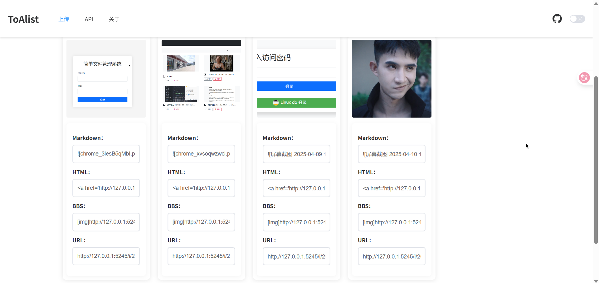
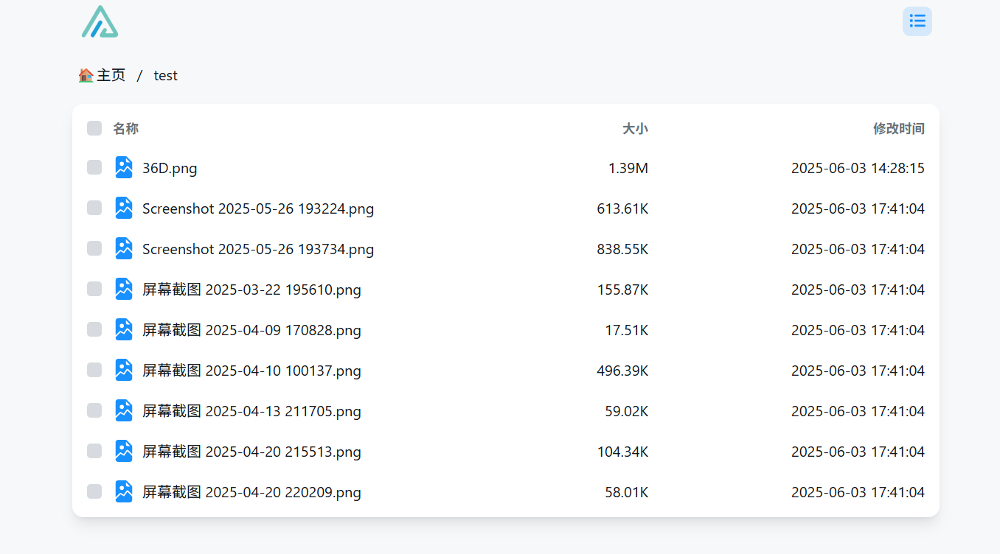
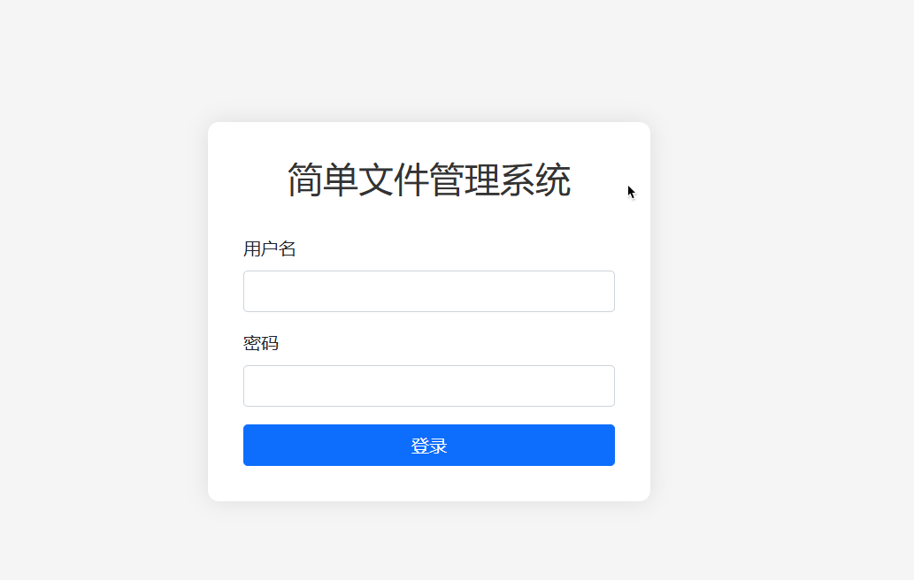
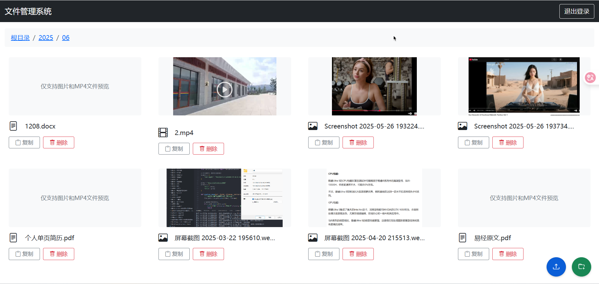

Toalist 一个基于 Golang 开发的 Web 应用，主要作为 [Alist](https://github.com/AlistGo/alist) 文件列表程序的前置应用。也可不依赖于Alist 独立使用。

## 功能特点

- 与 Alist 后端集成
- 自定义文件上传处理（从本程序到Alist支持流式或表单上传）
- 简易用户认证系统
- 文件类型过滤
- 文件大小限制
- 文件名重名
- 本地图像加密 （local模式下生效）
- 对 Alist 后端代理
- 简易文件管理界面

## 配置说明

配置 `conf/conf.ini` 文件
首次运行项目时可先编辑好配置文件直接启动运行，如果不想动手新建文件，可直接运行程序，会生成默认配置文件，然后在对配置文件进行修改，**每次修改文件都需要重启服务才会生效**，默认启动的是本地模式 local ,也就是不对接 Alist 。具体配置看以下信息：

```ini
[base]
mode = release                      # 应用程序模式（debug/release）,默认为release
host = 0.0.0.0                    # 绑定的主机地址,0.0.0.0 是允许任何主机访问，按需修改
port = 5245                       # 监听的端口，Docker 用户不建议更改，直接从外部映射即可
url = http://127.0.0.1:5245       # 应用程序的公共 URL，通俗讲就是你给本程序绑定的访问地址，可以是ip也可以是域名，可以带端口，末尾不带 /

[alist]
alist_url = http://your-alist-server.com    # Alist 网站地址，不带斜杆 /
alist_api_url = http://127.0.0.1:5244       # Alist API 地址，可以和上面的一样，如果alist 和toalist 部署在同一个内网中，建议填内网的地址
alist_username = user                       # Alist 用户名, 建议单独创建一个普通用户
alist_password = encrypted_password          # 加密的 Alist 密码，需要运行命令生成加密后的密码，具体看下面文档：密码管理
alist_path = /path                           # 在 Alist 中使用的基本路径，就是你要上传文件到目标路径。必须从根目录/开始填写
isproxy = false                              # 是否代理 Alist ，填true开启， 默认为不代理，代理后可以起到隐藏后端Alist 站点的作用，如果你的Alsit未开发公网范围也可被代理，前提是alist_url要填写本程序能达的目标内网地址。开启代理后下载文件的流量还需从本程序过一道。

[upload]
upload_method = form              # 上传到Alist方法 stream流式上传 form 表单上传（推荐） local 上传到应用所在位置，既本地模式，也是默认启动的配置
allow_types = jpg,jpeg,png,gif,pdf,doc,docx,xls,xlsx,ppt,pptx,txt,zip,rar,7z,mp4,webp  # 允许的文件类型，自行修改，每个后缀之间用,号分开如果仅是于图床只需设置图片文件格式即可，如：jpg,jpeg,png,gif,webp
max_file_size = 50                # 允许上传的最大文件大小（MB），如果使用了nginx之类的反代，需自行更改配置
keep_original_name = true         # 是否保留原始文件名，默认为true 保存为原始文件，设置为false 会在文件尾部加入时间戳，主要是为了解决，重名文件会被覆盖的问题
local_upload_path = /i            # 本地 local 模式下的文件上传路径，按需配置即可
is_local_img_encrypt = false      # 是否加密本地图像，默认为false 不启用，填写 true 启用，如果启用将对图片类型范围返回的链接地址加密。（仅适用于本地 local 模式下）

# 以下配置只会对本地 local 模式下生效

[login]
username = admin                  # 本地文件管理的登录用户名
password = hashed_password        # 本地文件管理的登录密码，需要对其加密后填写，具体看下面文档：密码管理
admin_page = /manager             # 本地文件管理页面路径，按需修改
```

配置文件中层级结构不能混乱，一般只需更改 `=` 后面的值即可,建议删除注释。

## 二进制程序安装

### Windows

1. 从[Release](https://github.com/lovebai/toalist/releases)下载最新的 Windows 版本
2. 解压 ZIP 文件
3. 创建或编辑 `conf/conf.ini` 文件进行配置
4. 运行 `toalist.exe`

### Linux

1. 从[Release](https://github.com/lovebai/toalist/releases)下载最新的 Linux 版本
2. 解压 tar.gz 文件
3. 创建或编辑 `conf/conf.ini` 文件进行配置
4. 运行可执行文件：
   ```bash
   chmod +x toalist
   ./toalist
   ```

### macOS

1. 从[Release](https://github.com/lovebai/toalist/releases)下载最新的 macOS 版本
2. 解压 tar.gz 文件
3. 创建或编辑 `conf/conf.ini` 文件进行配置
4. 运行可执行文件：
   ```bash
   chmod +x toalist
   ./toalist
   ```

## 作为服务运行

### Linux (systemd)

1. 创建 systemd 服务文件：

   ```bash
   sudo nano /etc/systemd/system/toalist.service
   ```
2. 添加以下内容：

   ```
   [Unit]
   Description=Toalist Service
   After=network.target

   [Service]
   Type=simple
   User=your_user
   WorkingDirectory=/usr/toalist  # ToAlist 程序所在目录
   ExecStart=/usr/toalist/toalist # ToAlist 程序路径地址
   Restart=on-failure
   RestartSec=5s

   [Install]
   WantedBy=multi-user.target
   ```
3. 启用并启动服务：

   ```bash
   sudo systemctl daemon-reload
   sudo systemctl enable toalist # 开机自启
   sudo systemctl start toalist
   ```

### Windows (NSSM)

1. 从 [nssm.cc](https://nssm.cc/download) 下载 NSSM（Non-Sucking Service Manager）
2. 解压并以管理员身份打开命令提示符
3. 运行：
   ```
   nssm.exe install Toalist
   ```
4. 在 GUI 中设置：
   - 路径：toalist.exe 的路径
   - 启动目录：toalist 目录的路径
   - 服务名称：Toalist
5. 点击"安装服务"

## Docker 部署

github 仓库和 docker hub 仓库，看自己需求使用。

github :

```
ghcr.io/lovebai/toalist:latest
```

docker hub :

```
kukudebai/toalist:latest
```

### 使用 Docker Run

```bash
docker run -d \
  --name toalist \
  -p 5245:5245 \
  -v /usr/toalist/conf:/conf \
  -v /usr/toalist/i:/i \
  --restart always \
  ghcr.io/lovebai/toalist:latest
```

### 使用 Docker Compose

创建 `docker-compose.yml` 文件：

```yaml
services:
  toalist:
    image: ghcr.io/lovebai/toalist:latest
    container_name: toalist
    ports:
      - "5245:5245"
    volumes:
      - ./conf:/conf # 配置文件目录
      - ./i:/i # 本地上传文件目录
    restart: unless-stopped
```

然后运行：

```bash
docker-compose up -d
```

## 密码管理

### 生成本地文件管理密码

```bash
./toalist -md5 your_password
```

Docker 命令：

```bash
docker exec container_name "./main -md5 your_password"
```

复制输出并将其粘贴到 `conf.ini` 文件的 `[login]` 部分。

### 加密 Alist 密码

```bash
./toalist -aes your_alist_password
```

Docker 命令：

```bash
docker exec container_name "./main -md5 your_alist_password"
```

复制输出并将其粘贴到 `conf.ini` 文件的 `[alist]` 部分。

## 效果预览

### 主页






### 简易本地文件管理





## 技术栈

- Golang
- Gin
- Vue3
- Element Plus
- Bootstrap5

## 许可证

[MIT](https://opensource.org/licenses/MIT)


